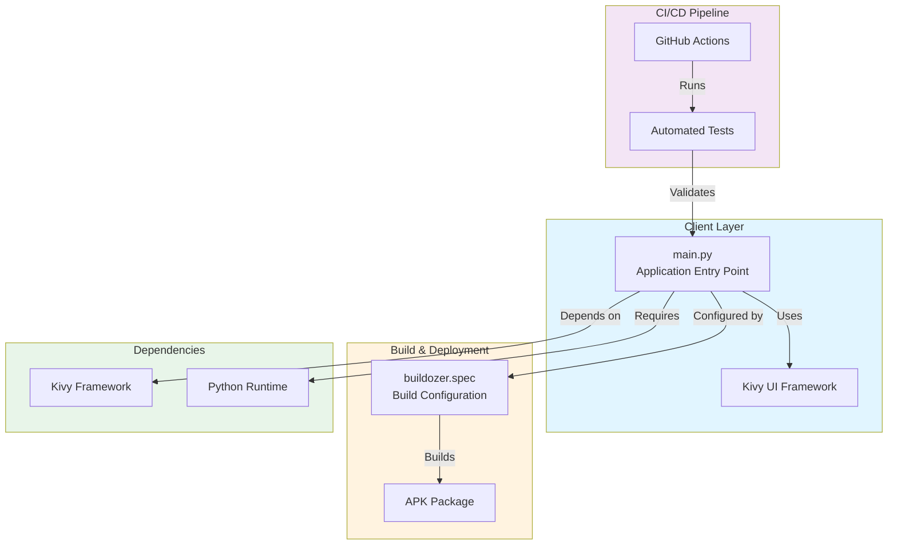
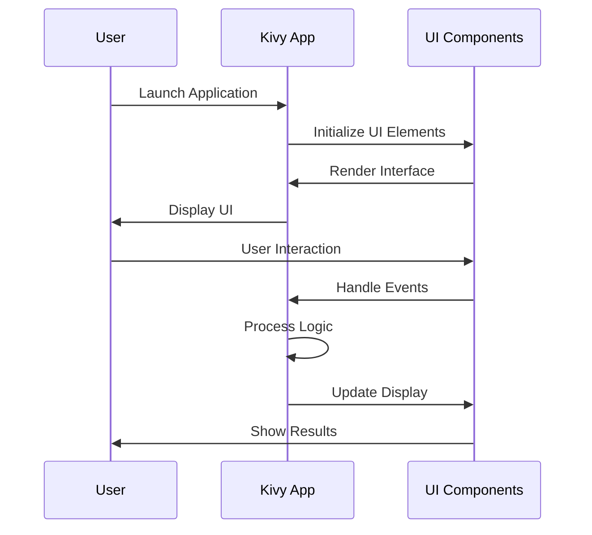
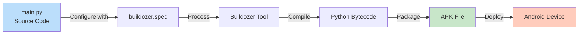

# Architecture Overview

This document describes the architecture of the My Kivy App project.

## System Architecture



## Component Description

### Client Layer
- **main.py**: Entry point of the Kivy application. Initializes and runs the application.
- **Kivy UI Framework**: Cross-platform Python framework for building touch-enabled applications.

### Build & Deployment
- **buildozer.spec**: Configuration file that specifies build parameters, permissions, and settings for creating Android APK packages.
- **APK Package**: Final compiled application package for Android deployment.

### CI/CD Pipeline
- **GitHub Actions**: Automated workflow for continuous integration and deployment.
- **Automated Tests**: Validates code quality and functionality before release.

### Dependencies
- **Kivy Framework**: Core UI framework dependency.
- **Python Runtime**: Language runtime required to execute the application.

## Data Flow



## Build Process



## Development Setup

The project follows a standard Kivy application structure:

```
my-kivy-app/
├── main.py              # Application entry point
├── buildozer.spec       # Build configuration
├── .github/
│   └── workflows/       # GitHub Actions workflows
├── README.md            # Project documentation
└── requirements.txt     # Python dependencies
```

## Technology Stack

- **Language**: Python 3.x
- **UI Framework**: Kivy
- **Build Tool**: Buildozer
- **CI/CD**: GitHub Actions
- **Target Platform**: Android

## Getting Started

1. Install Python and Kivy dependencies
2. Configure buildozer.spec with your app details
3. Run: `buildozer android debug`
4. Test the APK on an Android device or emulator